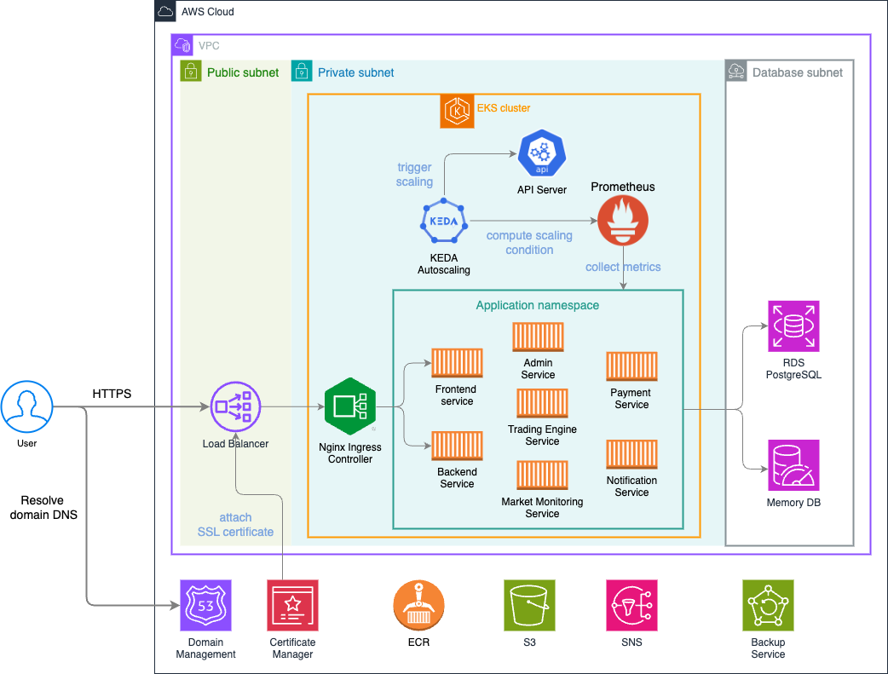

Provide your solution here:

> Diagram link: [https://drive.google.com/file/d/1zHYgiHgq8XPCsWgUv6hgnIhq3q_PYvKq/view?usp=sharing](https://drive.google.com/file/d/1zHYgiHgq8XPCsWgUv6hgnIhq3q_PYvKq/view?usp=sharing)

This diagram show a cloud-native and microservice-base architecture of trading system like Binance. Here are some key features in this system

## Infrastructure-level components
- **Domain Management**: Use Route53 as domain management, each DNS configuration will be managed in it.
- **VPC**: Follow three-tier layer, split into 3 subnets
  - Public subnet: deployed internet-facing, public accessible components
  - Private subnet: host the internal system (EKS cluster), which only be connected via a Network Loadbalance in public subnet
  - Database subnet: host the database components like RDS PostgreSQL, MemoryDB to isolate from other components, enhance security.
- **Netowrk Load Balancer**: Serve as Internet-facing load balancer, it proxy and forward traffic to internal system.
- **Certificated Manager**: Provide SSL cerificate and to be attached to Network Load Balancer.
- **EKS(Elastic Kubernetest Service)**: Contain orchestration service, provide the powerful features to build a high performance, availability and scalable system, especial for microservice-base system.
- **ECR(Elastic Container Registry)**: Used to store Docker images.
- **S3(Simple Storage Service)**: Store assets files, user data and other files.
- **SNS(Simple Notification Service)**: Send notification to difference kind of channels(SMS, Telegram, Slack, etc).
- **Backup Service**: A schedule, simple backup solution provided for RDS PostgreSQL, S3.
- **RDS PostgreSQL**: A managed relational database service for storing transactional data.
- **MemoryDB**: An high-performance, in-memory key-value database service, use for caching
### Alternative solutions to consider
- **EKS**: consider to use self-hosted K8s cluster
- **S3**: self-hosted [MinIO](https://min.io/) with high IOPS EBS volume (high throughput)
- **SNS**: [Firebase](https://firebase.google.com/), if almost of your users use mobile app
- **MemoryDB**: Redis, KeyDB
## Application-level components
Here are the explaination of application-level components, deployed in K8s cluster
- **Nginx Ingress Controller**: Kubenetes Ingress proxy, routing incoming requests based on URL domain and path rules.
- Microservices
  - **Frontend Service**: Handles the user interface and presentation logic.
  - **Backend Service**: Manages the core business logic and data processing.
  - **Admin Service**: Provides administrative functionalities for managing the platform.
  - **Payment Service**: Processes transactions and integrates with payment gateways.
  - **Trading Engine Service**: The heart of the platform, executing trades based on user orders and market conditions.
  - **Market Monitoring Service**: Tracks market data, prices, and trends.
  - **Notification Service**: Sends alerts and notifications to users (e.g., order confirmations, price alerts).
- **Prometheus**: collect metrcis from Node, Pods and other target
- **KEDA Autoscaling**: Automatically scales the microservices based on events or metrics.For example to scale service based on average request latency:
  - Query:
    ```
    avg(rate(http_request_duration_seconds_sum{service="trading-engine"}[1m])) * 1000
    ```
  - Threshold: 200 (representing 200ms)
  - Scaling targets: backend services, trading services
  - Min-max replicas : 2-10
  - KEDA `ScaleObject` deployment:
    ```yaml
    apiVersion: keda.sh/v1alpha1
    kind: ScaledObject
    metadata:
      name: trading-engine-scaler
    spec:
      scaleTargetRef:
        name: trading-engine-deployment
      triggers:
      - type: prometheus
        metadata:
          serverAddress: <PROMETHEUS_SERVER_ADDRESS>
          query: avg(rate(http_request_duration_seconds_sum{service="trading-engine"}[1m])) * 1000
          threshold: '200'
      minReplicaCount: 2
      maxReplicaCount: 10
    ```
